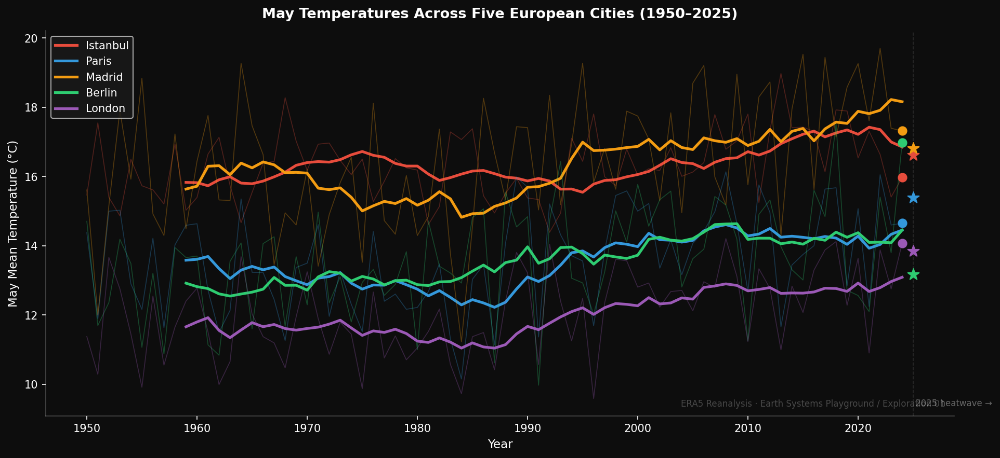

# Earth Systems Playground

> *Before the City Wakes — early morning explorations of a changing planet.*

Small computational experiments at the intersection of climate data, 
machine learning, and scientific curiosity. One question, one notebook, 
one visual, one insight.

Each exploration uses whatever fits the question — a reanalysis dataset, 
a satellite image, an AI model, an API. The tools change. 
The questions don't stop coming.

---

## Explorations

### 01 — May Is the New July
**Question:** How much has May actually changed across Europe since 1950?

**Inspiration:** In May 2026, Europe recorded an unusually early heatwave — 
France breaking May temperature records, the UK logging its hottest May day 
ever. Around the same time, Irina Sandu (Director of the EU Destination Earth 
initiative at ECMWF) shared stunning visuals made from ClimateDT 
kilometre-scale simulations and issued a small challenge: make something 
beautiful or surprising from the data. I didn't have ClimateDT access. 
But I had ERA5 and a question.

**Dataset:** ERA5 Monthly Averaged 2m Temperature, 1950–2025  
via [Copernicus Climate Data Store](https://cds.climate.copernicus.eu)  
Spatial extent: 72°N–35°N, 15°W–45°E (Europe + Turkey)  
Resolution: 0.25° × 0.25° (~28km)

**Methods:**
- Linear trend estimation per grid cell (scipy.stats.linregress)
- 10-year rolling mean for city time series
- Diverging colormap visualization (cooling vs warming regions)

**Key findings:**
- Mean May warming across the domain: +0.021°C/year → +1.55°C since 1950
- Strongest warming: Norwegian coast and Arctic fringe (+0.07–0.085°C/year)
- Madrid overtook Istanbul in May temperatures around 1985–1990
- Visualization choice matters: diverging vs sequential colormap 
  tells fundamentally different stories from the same data

**Figures:**
| | |
|---|---|
|  |  |

**Notebook:** [exploration_01.ipynb](exploration_01_may_is_the_new_july/notebook.ipynb)  
**Substack:** [Read the full post →](https://your-substack-url-here)

---

## Structure

Each exploration lives in its own folder:
earth-systems-playground/
├── README.md
├── exploration_01_may_is_the_new_july/
│   ├── notebook.ipynb
│   └── figures/
│       ├── exploration_01_diverging.png
│       └── exploration_01_cities_2025.png
├── exploration_02_.../
│   └── ...

## Setup

Explorations run in Google Colab. No local installation needed.  
Each notebook includes setup instructions.

For ERA5 data access, you'll need a free 
[CDS account](https://cds.climate.copernicus.eu/how-to-api).

---

## About

This repository is the technical companion to the 
*Before the City Wakes* series on 
[Code Beyond the Earth](https://codebeyondtheearth.substack.com) — 
a Substack about climate AI, scientific computing, and AI for Science.

**Author:** Ece — Senior Software Engineer & Climate AI Researcher  

---

*The schedule is whenever the coffee is ready.*
